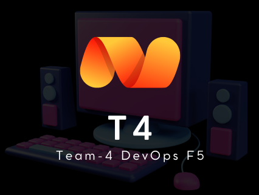

# Getting Started

# Project: Magic Detail Shop!
## Welcome to crazy products, don't stop buying today if you were going to buy it tomorrow.

 What do we sell? At Random Shop we bet on chaos as a hallmark. When someone comes to our store we want them to feel completely lost, and not know what they are going to buy (or how much they are going to pay for it). Today, our stock consists of pets, gourmet products, Magic cards and footwear (outlet).

Our previous programmer, Mariano, has left the company to set up his own startup selling motorcycles using blockchain. Luckily, we have been able to hire you to continue working on our sales system.

* [More info in readme THIS pROYECT](https://github.com/jmatisam/crazyproducts-_ramdomShop-kata)
## Guides of de Proyect
The following guides illustrate how to use some features concretely:
* [Oficial Guide of Proyect](https://www.canva.com/design/DAGIgrvvJP4/hOPIi2iH5ONc5yRDCF9Cjw/view?utm_content=DAGIgrvvJP4&utm_campaign=designshare&utm_medium=link&utm_source=editor)

* [Guide for First Steps in the App](https://www.canva.com/design/DAGIgrvvJP4/hOPIi2iH5ONc5yRDCF9Cjw/view?utm_content=DAGIgrvvJP4&utm_campaign=designshare&utm_medium=link&utm_source=editor)

### Reference Documentation
For further reference, please consider the following sections:

* [Official Apache Maven documentation](https://maven.apache.org/guides/index.html)
* [Spring Boot Maven Plugin Reference Guide](https://docs.spring.io/spring-boot/docs/3.3.2-SNAPSHOT/maven-plugin/reference/html/)
* [Create an OCI image](https://docs.spring.io/spring-boot/docs/3.3.2-SNAPSHOT/maven-plugin/reference/html/#build-image)
* [Thymeleaf](https://docs.spring.io/spring-boot/docs/3.3.2-SNAPSHOT/reference/htmlsingle/index.html#web.servlet.spring-mvc.template-engines)
* [Spring Web](https://docs.spring.io/spring-boot/docs/3.3.2-SNAPSHOT/reference/htmlsingle/index.html#web)
* [Spring Security](https://docs.spring.io/spring-boot/docs/3.3.2-SNAPSHOT/reference/htmlsingle/index.html#web.security)
* [Spring Data MongoDB](https://docs.spring.io/spring-boot/docs/3.3.2-SNAPSHOT/reference/htmlsingle/index.html#data.nosql.mongodb)

### Guides
The following guides illustrate how to use some features concretely:

* [Handling Form Submission](https://spring.io/guides/gs/handling-form-submission/)
* [Building a RESTful Web Service](https://spring.io/guides/gs/rest-service/)
* [Serving Web Content with Spring MVC](https://spring.io/guides/gs/serving-web-content/)
* [Building REST services with Spring](https://spring.io/guides/tutorials/rest/)
* [Securing a Web Application](https://spring.io/guides/gs/securing-web/)
* [Spring Boot and OAuth2](https://spring.io/guides/tutorials/spring-boot-oauth2/)
* [Authenticating a User with LDAP](https://spring.io/guides/gs/authenticating-ldap/)
* [Accessing Data with MongoDB](https://spring.io/guides/gs/accessing-data-mongodb/)

### Maven Parent overrides

Due to Maven's design, elements are inherited from the parent POM to the project POM.
While most of the inheritance is fine, it also inherits unwanted elements like `<license>` and `<developers>` from the parent.
To prevent this, the project POM contains empty overrides for these elements.
If you manually switch to a different parent and actually want the inheritance, you need to remove those overrides.

